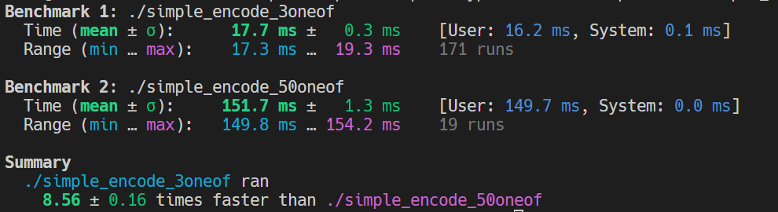
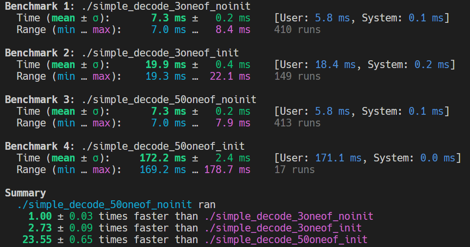

# Influence of proto-message structure on decoding and encoding time

We are using relatively big "oneof"-messages in our proto-files and I found that Nanopb spends quite some time in iterating over these "oneof" fields. I think this is mainly caused by the necessity of setting default values that may not be zero. But this somehow feels unnecessary because at maximum only one of these fields could be set at any time and it would be possible by looking at the `which_*`-struct member, to determine which field actually needs to be checked for default values. Also as we are only using "proto 3" we have no default values at all.

I modified the "simple"-example by adding 3 "oneof"s and respective 50 "oneof"s to the "SimpleMessage". But I do not initalize them, so that still the complete message can be represented as `message.lucky_number = 13` and will encode to just the 2 bytes `0x08, 0x0D`.

When using `pb_decode_noinit` the "SimpleMessage" with 50 "oneof"s gets decoded ~20times faster than when using the normal `pb_decode`function. Also with `pb_decode_noinit` there seems to be no performance penalty compared to a "SimpleMessage" with only 3 "oneof"s.

Unfortunately there is currently no `pb_encode_noinit` or `pb_encode_nodefaults` variant, that could be used to tell Nanopb not to try to set the default values. In my benchmarking the "SimpleMessage" with 50 "oneof"s ist ~8 times slower than the 3 "oneof"s message. 

Could you consider adding such a function? Or maybe also (if possible) add some logic that looks at the `which_*`-struct member and only iterates of the necessary fields?

## My measurements:

### Encoding

### Decoding

